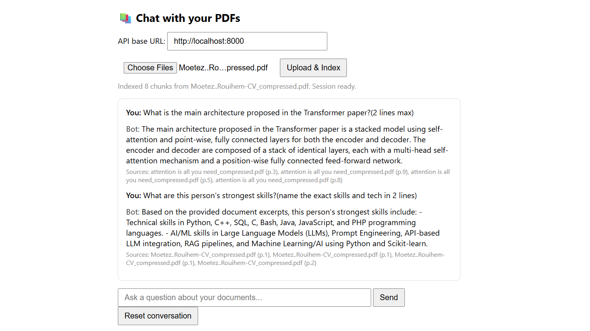

# 📚 Conversational Multi-Doc RAG Assistant

A conversational AI assistant that lets you upload multiple PDFs and ask natural-language questions about them — with memory across turns and source citations (file + page number) for every answer.

Built as a portfolio project to demonstrate a full, working RAG (Retrieval-Augmented Generation) pipeline: document ingestion, chunking, embedding, vector search, conversational memory, and grounded generation — served through a simple API with a lightweight browser UI.

---

## ✨ Features

- **Multi-document upload** — index several PDFs into a single session
- **Conversational memory** — follow-up questions ("can you go deeper on that?") work, using the last 5 Q&A turns
- **Source citations** — every answer includes which file and page it came from
- **Session isolation** — each upload gets its own session with its own vector index and history
- **Relevance filtering** — chunks below a similarity threshold are dropped instead of blindly stuffed into the prompt
- **Free-tier friendly** — local embeddings (no API key needed) + Groq's free, fast LLM inference

---

## 🏗️ Architecture

```
Client (frontend/index.html, curl, or your own app)
   │
   ├── POST /upload   → uploads PDFs, returns a session_id
   ├── POST /query    → asks a question within a session (uses last 5 turns of history)
   ├── POST /reset    → clears conversation memory, keeps documents
   ├── DELETE /session/{id} → deletes a session entirely
   └── GET  /health
```

Each session is backed by a `RAGSystem` instance holding:
- its own **FAISS** vector index (in memory)
- its own **bounded conversation history** (last 5 Q&A turns — older turns are dropped so the prompt doesn't grow unbounded)

### Request flow

```
PDF upload → text extraction (pypdf) → chunking (LangChain splitter)
   → embedding (HuggingFace MiniLM) → FAISS index

Question → similarity search (FAISS) → relevance filtering
   → prompt assembly (context + chat history) → Groq LLM → answer + sources
```

---

## 🛠️ Stack

| Component        | Technology                                      |
|-------------------|--------------------------------------------------|
| API layer          | FastAPI                                        |
| Orchestration       | LangChain                                     |
| Vector store         | FAISS (in-memory, per session)              |
| Embeddings            | HuggingFace `sentence-transformers/all-MiniLM-L6-v2` (local, free) |
| LLM                     | Groq — `llama-3.1-8b-instant` (free tier)  |
| PDF parsing               | pypdf                                    |
| Frontend                    | Plain HTML/JS (no build step)          |

---

## 📁 Project Structure

```
Conversational multi-doc assistant with memory/
├── main.py              # FastAPI app: routes for upload/query/reset/session
├── rag.py                # Core RAG engine (RAGSystem class)
├── requirements.txt       # Python dependencies
├── .env                    # GROQ_API_KEY (not committed)
├── .gitignore
├── rag.ipynb               # Dev/exploration notebook (optional)
├── README.md
└── frontend/
    └── index.html          # Minimal chat UI, opened directly in a browser
```

> **Note:** `main.py` and `rag.py` live at the project root — they are not inside an `app/` package. Run the server with `uvicorn main:app`, not `uvicorn app.main:app`.

---

## 🚀 Local Setup

### 1. Clone and create a virtual environment

```bash
git clone <your-repo-url>
cd "Conversational multi-doc assistant with memory"

python -m venv venv
source venv/bin/activate      # Windows: venv\Scripts\activate
```

### 2. Install dependencies

```bash
pip install -r requirements.txt
```

### 3. Add your Groq API key

Create a `.env` file in the project root:

```
GROQ_API_KEY=your_actual_key_here
```

Get a free key at [console.groq.com](https://console.groq.com).

### 4. Run the API

```bash
uvicorn main:app --reload
```

The API will be live at **http://localhost:8000**, with interactive docs (Swagger UI) at **http://localhost:8000/docs**.

### 5. Use the UI

Open `frontend/index.html` directly in your browser — no server needed for the frontend. Point the "API base URL" field at `http://localhost:8000`, upload a PDF, and start asking questions.

---

## 📄 License

MIT — feel free to fork and build on this.
